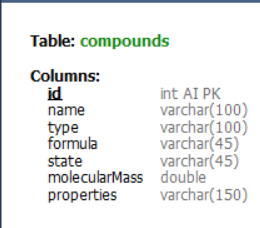
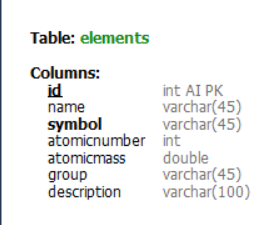

# Periodic Table API - Spring Boot

API RESTful desarrollada en **Spring Boot** que proporciona información sobre los elementos químicos de la tabla periódica. 
Ideal para aplicaciones educativas, científicas o de consulta general.

## Tabla de contenidos.
- [Caraacterístias](#características)
- [Tecnologías](#tecnologías)
- [Intalación](#instalación)
- [Estructura de datos](#estructura-de-datos)

## Características.
- API REST para consultar elementos químicos y compuestos.
- Filtros por número atómico, símbolo, nombre y masa atómica, formula (compuesto), nombre (compuesto).
- Arquitectura basada en capas (Controller, Service, Repository).
- Manejo de errores y validaciones.

## Tecnologías.
- Java 17+.
- Spring (Spring Boot).
- Spring Web.
- Spring Data JPA.
- MySQL connector.
- Spring annotation.

## Instalación.
- Clonar el repositorio.
- Cambiar credenciales de acceso a base de datos.

## Estructura de datos.
Elementos

### Elementos
- GET http://localhost:8080/elements
- GET http://localhost:8080/elements/atomic/mass/{mass}
- GET http://localhost:8080/elements/atomic/number/{number}
- GET http://localhost:8080/elements/group/{group}
- GET http://localhost:8080/elements/name/{name}
- GET http://localhost:8080/elements/symbol/{symbol}

### Compuestos
- GET http://localhost:8080/compounds
- GET http://localhost:8080/compounds/formula/{formula}
- GET http://localhost:8080/compounds/name/{name}
- GET http://localhost:8080/compounds/state/{state}
- GET http://localhost:8080/compounds/type/{type}

## Ejemplo de respuesta.
```json
{
  "id":1,
  "name":"Hidrogen",
  "symbol":"H",
  "atomicnumber":1,
  "atomicmass":1.0079,
  "group":"1A",
  "description":"Most abundant chemical element"
}
```
## Estructura de la base de datos.

